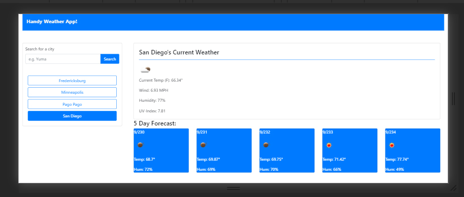

# weatherHub
a weather hub for specific location. including a 5 day forecast.

# Description

This weather application lets you view the current weather of most cities throughout the world! 
Once a location is searched you are then given information pertaining to that cities weather, including; Temperature, Humidity, Wind Speed, and UV Index! You are also given the predicted 5 day forecast.

## Repository and Deployed
Repository can be found here https://github.com/dohmr/weatherHub

Deployed app URL, here https://dohmr.github.io/weatherHub/

## Usage
Input any City within the search bar. You are also given a few preset options of my choosing. You then submit your choice and are then presented with the current weather and a 5 day forecast! Brilliant!

## Tools
Bootstrap framework
jQuery, javaScript, HTML, CSS
https://openweathermap.org/api 

## Screens
Scaled down for mobile device:

;

Full browsrer view:

;
